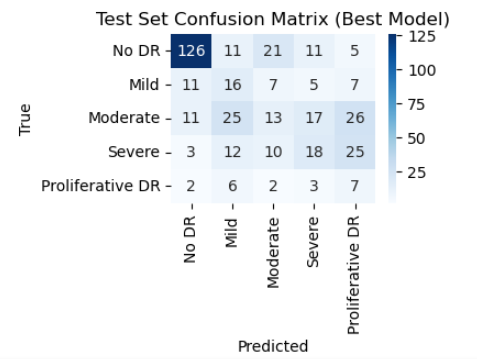

# CLASSIFYING THE SEVERITY OF DIABETIC RETINOPATHY FROM RETINAL FUNDUS IMAGES 

This project forms part of the course work for the Imperial College Professional Certificate in Machine Learning and Artificial Intelligence.

It develops an AI model to automatically detect and classify diabetic retinopathy, a serious eye condition caused by diabetes, using retinal images. The model analyses small, coloured images of the back of the eye to identify five levels of severity: no disease, mild, moderate, severe, or proliferative. By training on a dataset of 2,400 images, the AI learns to spot patterns indicating disease severity, aiming to assist doctors in early diagnosis. Despite challenges with imbalanced data, the model achieves moderate accuracy, offering a foundation for future improvements in medical image analysis.

## DATA
The project uses the RetinaMNIST dataset from MedMNIST v3.0.2, comprising 2,400 retinal fundus images (1,600 training, 400 validation, 400 test) resized to 64x64 pixels in RGB format. Each image is labeled with one of five DR severity levels: No DR (~50%), Mild (~10%), Moderate (~20%), Severe (~10%), or Proliferative DR (~10%). Derived from the DeepDRiD dataset, RetinaMNIST is preprocessed for research use. Images are normalized with `mean=0.5`, `std=0.5`. Training data includes augmentation: random horizontal flips (p=0.5), rotations (60°), resized crops (scale 0.6–1.0), color jitter (brightness, contrast, saturation=0.5, hue=0.1), affine transforms (translation=0.1, scale=0.8–1.2), and Gaussian blur (kernel=3, sigma=0.1–2.0).

**Citation**:
- Yang, J., et al. "MedMNIST v3: A Large-Scale Lightweight Benchmark for 2D and 3D Biomedical Image Classification." *Scientific Data* (2024). DOI: 10.1038/s41597-024-03629-z.
- DeepDRiD dataset: https://github.com/DeepDRiD/DeepDRiD.
- MedMNIST v3.0.2: https://github.com/MedMNIST/MedMNIST/.

## MODEL
The model, `RetinaCNN_BO`, is a convolutional neural network (CNN) designed for lightweight classification of diabetic retinopathy on RetinaMNIST. It has three convolutional layers (with 16, 32, 64 filters in the best configuration), each followed by batch normalization, ReLU activation, and max-pooling, and two fully connected layers (128 units, then 5 units) with dropout (0.589). Focal loss and weighted sampling address class imbalance. This architecture was chosen for its simplicity, suitability for small datasets, and computational efficiency, making it ideal for rapid prototyping and educational purposes. 

## HYPERPARAMETER OPTIMISATION
The model optimizes five hyperparameters using Bayesian optimization with TPESampler over 50 trials:
- Learning rate (lr): [1e-5, 3e-4], best: 1.234e-05
- Batch size: [16, 32], best: 16
- Dropout rate: [0.3, 0.7], best: 0.589
- Number of filters: [[8, 16, 32], [16, 32, 64], [32, 64, 128]], best: [16, 32, 64]
- Weight decay: [0.0, 1e-3], best: 0.000565
Bayesian optimization was chosen to efficiently explore the hyperparameter space, maximizing validation accuracy while balancing computational cost. Focal loss parameters (gamma=3.0, alpha=[0.5, 1.0, 1.0, 2.0, 2.0]) were fixed to address class imbalance. 

## RESULTS
The model achieved a best validation accuracy of 56.67% (Trial 11) but a final validation accuracy of 50.00% and test accuracy of 45.00% on the 400-image test set, indicating retraining instability. The test confusion matrix shows strong performance on No DR (126/174 correct, ~72%) but poor results on minority classes (Mild: 16/46, ~34.8%; Moderate: 13/92, ~13.8%; Severe: 18/68, ~26.5%; Proliferative DR: 7/20, ~35.0%). This suggests the model struggles with class imbalance, despite focal loss and weighted sampling. The results highlight the need for further hyperparameter optimisation. 

