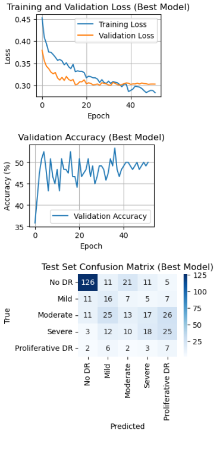

# Classifying Severity of Diabetic Retinopathy from Retinal Fundus Images - MODEL CARD

## Model Description

### Input:
The model takes as input 64x64 pixel RGB images of human retinas (fundus photographs) from the RetinaMNIST dataset. Each image is preprocessed with data augmentation for training (RandomHorizontalFlip(p=0.5), RandomRotation(45), RandomResizedCrop(64, scale=(0.6, 1.0)), ColorJitter(brightness=0.5, contrast=0.5, saturation=0.5, hue=0.1), RandomAffine(degrees=0, translate=(0.1, 0.1), scale=(0.8, 1.2)), ToTensor()) and minimal preprocessing for validation/test (ToTensor()). Images are represented as 3-channel tensors of shape [3, 64, 64]. 

### Output:
The model outputs a probability distribution over 5 classes representing diabetic retinopathy (DR) severity levels: No DR (0), Mild (1), Moderate (2), Severe (3), and Proliferative DR (4). The output is a tensor of shape [batch_size, 5], where each element represents the probability of a specific DR severity class. The predicted class is determined by the highest probability (argmax).

### Model Architecture:
The model, `RetinaCNN_BO`, is a convolutional neural network (CNN) designed for lightweight classification on the RetinaMNIST dataset. It consists of:
- **Convolutional Layers**:
  - Conv2d(3, f1, kernel_size=3, padding=1), followed by BatchNorm2d(f1), ReLU, MaxPool2d(kernel_size=2, stride=2)
  - Conv2d(f1, f2, kernel_size=3, padding=1), followed by BatchNorm2d(f2), ReLU, MaxPool2d(kernel_size=2, stride=2)
  - Conv2d(f2, f3, kernel_size=3, padding=1), followed by BatchNorm2d(f3), ReLU, MaxPool2d(kernel_size=2, stride=2)
  - Number of filters (f1, f2, f3) optimized via Bayesian optimization, typically [8, 16, 32] or [16, 32, 64]. Best trial used [16, 32, 64].
- **Fully Connected Layers**:
  - Flatten
  - Linear(f3 * 8 * 8, 128), ReLU, Dropout(p), Linear(128, 5)
  - Dropout rate (p) optimized, best trial used p=0.589.
- **Optimization**: Trained with Adam optimizer (lr=1.234e-05, weight_decay=0.000565 in best trial), FocalLoss (gamma=3.0, alpha=[0.5, 1.0, 1.0, 2.0, 2.0]), and ReduceLROnPlateau scheduler (factor=0.5, patience=5). WeightedRandomSampler used to address class imbalance. 

## Performance

The model’s performance was evaluated using classification accuracy on the RetinaMNIST dataset (1,600 training, 400 validation, 400 test images). Performance metrics are derived from a Bayesian optimization study with 50 trials using TPESampler, followed by retraining with the best hyperparameters.

- **Metrics**:
  - **Best Validation Accuracy**: 56.67% (Trial 11, hyperparameters: lr=1.234e-05, batch_size=16, dropout_rate=0.589, num_filters=[16, 32, 64], weight_decay=0.000565).
  - **Final Validation Accuracy**: 50.00% (after retraining with best hyperparameters, early stopping at epoch 52).
  - **Test Accuracy**: 45.00% (on 400 test images).
  - **Test Confusion Matrix**:
    ```
    [[126  11  21  11   5]  # No DR
     [ 11  16   7   5   7]  # Mild
     [ 11  25  13  17  26]  # Moderate
     [  3  12  10  18  25]  # Severe
     [  2   6   2   3   7]] # Proliferative DR
    ```
  - The model performs well on the majority class (No DR, ~72% correct) but struggles with minority classes (Mild: 34.8%, Moderate: 13.8%, Severe: 26.5%, Proliferative DR: 35.0% correct).

- **Evaluation Data**: Performance was measured on the RetinaMNIST test set (400 images), with validation during training on the validation set (400 images). The dataset is a preprocessed subset of the EyePACS Kaggle Diabetic Retinopathy Detection dataset, resized to 64x64 pixels.

- **Summary Graph**



## Limitations

- **Class Imbalance**: The model struggles with severe class imbalance in RetinaMNIST, with No DR dominating (~50% of samples) and minority classes (Mild, Moderate, Severe, Proliferative DR) underrepresented (~10–20% each). This leads to biased predictions favoring No DR, as shown in the test confusion matrix (e.g., only 13/92 correct for Moderate).
- **Low Resolution**: The 64x64 image size limits the model’s ability to capture fine-grained features (e.g., microaneurysms), reducing performance on severe DR grades compared to models trained on higher-resolution images.
- **Retraining Instability**: The gap between best trial validation accuracy (56.67%) and final validation accuracy (50.00%) indicates variability due to random weight initialization or data shuffling in WeightedRandomSampler.
- **Limited Generalizability**: Trained on EyePACS data (primarily U.S.-based clinical settings), the model may not generalize well to diverse populations or imaging devices. 
- **Not Clinically Deployable**: The model is designed for research and benchmarking, not for clinical diagnosis, due to its moderate accuracy and lack of validation on real-world clinical data.

## Trade-offs

- **Accuracy vs. Complexity**: The lightweight architecture (3 convolutional layers, 128-unit FC layer) is computationally efficient for rapid prototyping but sacrifices capacity to capture complex features, leading to lower accuracy (45.00% test) compared to deeper models or transfer learning approaches.
- **Class Balance vs. Training Stability**: Focal loss (gamma=3.0, alpha=[0.5, 1.0, 1.0, 2.0, 2.0]) and WeightedRandomSampler improve minority class performance but introduce training instability, as seen in the validation accuracy drop from 56.67% to 50.00%.
- **Generalization vs. Specialization**: Heavy data augmentation (e.g., RandomRotation(45), ColorJitter) enhances robustness to variations but may overfit to augmented patterns, reducing performance on untransformed test images.
- **Performance on Minority Classes**: The model prioritizes No DR accuracy at the expense of minority classes (e.g., Moderate: 13.8% correct, Severe: 26.5% correct), which could lead to misdiagnosis risks in real-world scenarios if used inappropriately. 
